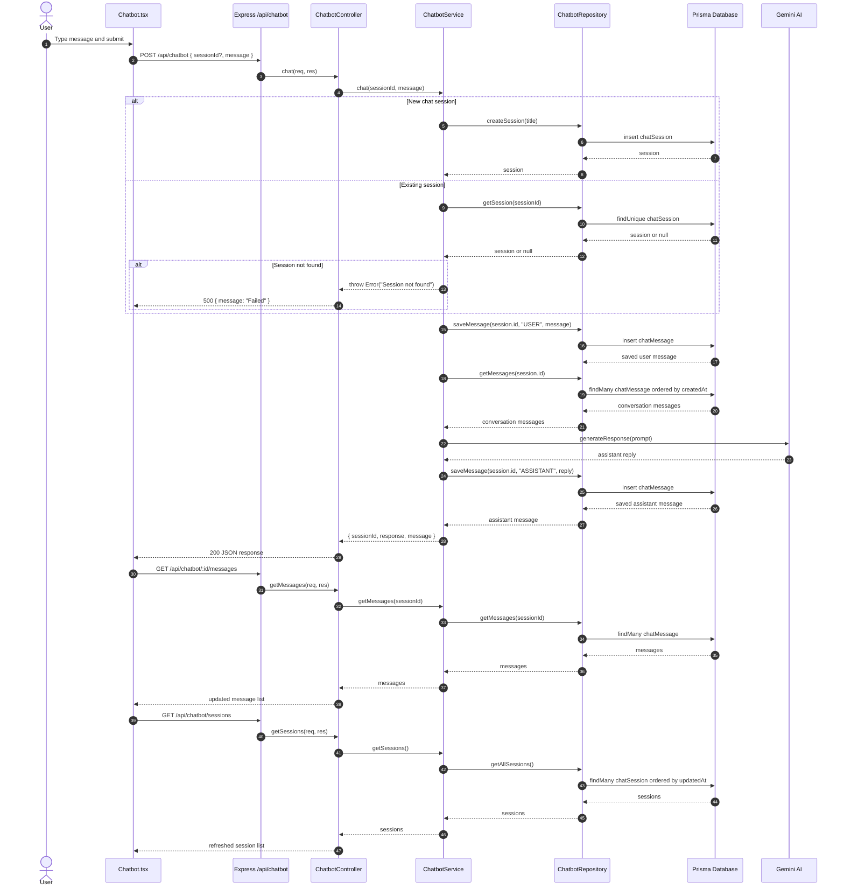

# Chatbot Sequence Diagram

```mermaid
sequenceDiagram
    autonumber
    actor User
    participant UI as Chatbot.tsx
    participant API as Express /api/chatbot
    participant Controller as ChatbotController
    participant Service as ChatbotService
    participant Repo as ChatbotRepository
    participant DB as Prisma Database
    participant Gemini as Gemini AI

    User->>UI: Type message and submit
    UI->>API: POST /api/chatbot { sessionId?, message }
    API->>Controller: chat(req, res)
    Controller->>Service: chat(sessionId, message)

    alt New chat session
        Service->>Repo: createSession(title)
        Repo->>DB: insert chatSession
        DB-->>Repo: session
        Repo-->>Service: session
    else Existing session
        Service->>Repo: getSession(sessionId)
        Repo->>DB: findUnique chatSession
        DB-->>Repo: session or null
        Repo-->>Service: session or null
        alt Session not found
            Service-->>Controller: throw Error("Session not found")
            Controller-->>UI: 500 { message: "Failed" }
        end
    end

    Service->>Repo: saveMessage(session.id, "USER", message)
    Repo->>DB: insert chatMessage
    DB-->>Repo: saved user message

    Service->>Repo: getMessages(session.id)
    Repo->>DB: findMany chatMessage ordered by createdAt
    DB-->>Repo: conversation messages
    Repo-->>Service: conversation messages

    Service->>Gemini: generateResponse(prompt)
    Gemini-->>Service: assistant reply

    Service->>Repo: saveMessage(session.id, "ASSISTANT", reply)
    Repo->>DB: insert chatMessage
    DB-->>Repo: saved assistant message
    Repo-->>Service: assistant message

    Service-->>Controller: { sessionId, response, message }
    Controller-->>UI: 200 JSON response
    UI->>API: GET /api/chatbot/:id/messages
    API->>Controller: getMessages(req, res)
    Controller->>Service: getMessages(sessionId)
    Service->>Repo: getMessages(sessionId)
    Repo->>DB: findMany chatMessage
    DB-->>Repo: messages
    Repo-->>Service: messages
    Service-->>Controller: messages
    Controller-->>UI: updated message list

    UI->>API: GET /api/chatbot/sessions
    API->>Controller: getSessions(req, res)
    Controller->>Service: getSessions()
    Service->>Repo: getAllSessions()
    Repo->>DB: findMany chatSession ordered by updatedAt
    DB-->>Repo: sessions
    Repo-->>Service: sessions
    Service-->>Controller: sessions
    Controller-->>UI: refreshed session list
```
